# JETSONSKY Architecture Diagrams (Mermaid Format)

This file contains architecture diagrams in Mermaid format that can be rendered in:
- GitHub/GitLab markdown
- VS Code (with Mermaid extension)
- Documentation sites
- Mermaid Live Editor: https://mermaid.live

---

## Current Monolithic Architecture

### File Structure - Current State


### Coupling Problem - Current State


---

## Proposed Modular Architecture

### Directory Structure - Proposed


### Layered Architecture - Proposed


### MVC Pattern


---

## Component Interaction Diagrams

### Image Acquisition Sequence


### Filter Configuration Sequence


### Camera Initialization Sequence


---

## Data Flow Diagrams

### Image Processing Pipeline

```mermaid
flowchart LR
    CAM[Camera<br/>Hardware] -->|Raw Bayer<br/>16-bit| ACQ[Acquisition<br/>Thread]
    ACQ -->|Raw Image| DEBAY[Debayer<br/>RGGB→RGB]
    DEBAY -->|RGB Image| PIPE[Filter<br/>Pipeline]

    subgraph FilterPipeline
        F1[Denoise KNN]
        F2[Sharpen]
        F3[Contrast CLAHE]
        F4[Saturation]
        F5[Color Balance]
        F1 --> F2 --> F3 --> F4 --> F5
    end

    PIPE -->|Filtered<br/>Image| CONV[Convert to<br/>Display Format]
    CONV -->|PIL Image| GUI[GUI Display]
    GUI --> USER[User]

    style CAM fill:#a9e34b,stroke:#74b816
    style ACQ fill:#74c0fc,stroke:#1971c2
    style DEBAY fill:#ffc9c9,stroke:#f03e3e
    style PIPE fill:#ffd43b,stroke:#f59f00
    style CONV fill:#d0bfff,stroke:#7950f2
    style GUI fill:#e7f5ff,stroke:#1971c2
```



### State Management Flow


### Filter Pipeline Flow


---

## Refactoring Migration Strategy

### 5-Phase Migration Plan


### Phase-by-Phase Code Reduction


### Dependency Evolution


---

## Class Diagrams

### Camera Model Registry


### Filter Pipeline


### MVC Architecture


---

## Metrics Visualization

### Code Distribution - Before vs After


### Complexity Reduction


---

## Testing Strategy

### Test Coverage Pyramid

```mermaid
graph TD
    subgraph "Test Pyramid"
        E2E[End-to-End Tests<br/>~10%<br/>Full application workflow]
        INT[Integration Tests<br/>~30%<br/>Module interactions]
        UNIT[Unit Tests<br/>~60%<br/>Individual functions/classes]
    end

    E2E --> INT
    INT --> UNIT

    style E2E fill:#e7f5ff,stroke:#1971c2
    style INT fill:#fff4e6,stroke:#f59f00
    style UNIT fill:#ebfbee,stroke:#2f9e44
```

### Test Organization

```mermaid
graph TB
    TESTS[tests/]

    TESTS --> UNIT[unit/]
    TESTS --> INT[integration/]
    TESTS --> E2E[e2e/]

    UNIT --> U1[test_filters.py<br/>Test each filter independently]
    UNIT --> U2[test_camera_models.py<br/>Test camera registry]
    UNIT --> U3[test_config.py<br/>Test data classes]

    INT --> I1[test_pipeline.py<br/>Test filter pipeline]
    INT --> I2[test_camera.py<br/>Test camera with SDK]
    INT --> I3[test_image_processor.py<br/>Test full processing chain]

    E2E --> E1[test_acquisition.py<br/>Test full acquisition flow]
    E2E --> E2[test_video_capture.py<br/>Test video recording]

    style TESTS fill:#e7f5ff,stroke:#1971c2,stroke-width:2px
    style UNIT fill:#ebfbee,stroke:#2f9e44
    style INT fill:#fff4e6,stroke:#f59f00
    style E2E fill:#ffe9ec,stroke:#f03e3e
```

---

## Deployment

### Package Structure

```mermaid
graph TB
    PKG[JetsonSky Package]

    PKG --> SRC[src/<br/>Source code]
    PKG --> TESTS[tests/<br/>Test suite]
    PKG --> DOCS[docs/<br/>Documentation]
    PKG --> CFG[Configuration files]

    SRC --> MODULES[All modules<br/>gui/, core/, filters/, etc.]

    TESTS --> UNIT_T[Unit tests]
    TESTS --> INT_T[Integration tests]

    DOCS --> API[API documentation]
    DOCS --> ARCH[Architecture docs]
    DOCS --> USER[User guide]

    CFG --> SETUP[setup.py]
    CFG --> REQ[requirements.txt]
    CFG --> CONFIG[config.yaml]
    CFG --> README[README.md]

    style PKG fill:#51cf66,stroke:#2b8a3e,stroke-width:3px
```

---

## Summary

These diagrams visualize the transformation from:
- **Monolithic nightmare**: 11,301 lines, 300+ globals, impossible to maintain
- **Clean architecture**: Modular, testable, maintainable, professional

**Key Improvements:**
- 96% reduction in largest file size
- 100% elimination of global variables
- 90% reduction in function dependencies
- Full test coverage capability
- Clear separation of concerns
- Industry-standard architecture patterns

You can view these diagrams:
1. In GitHub/GitLab (automatic Mermaid rendering)
2. In VS Code with Mermaid extension
3. At https://mermaid.live (paste the code blocks)
4. In your documentation site
